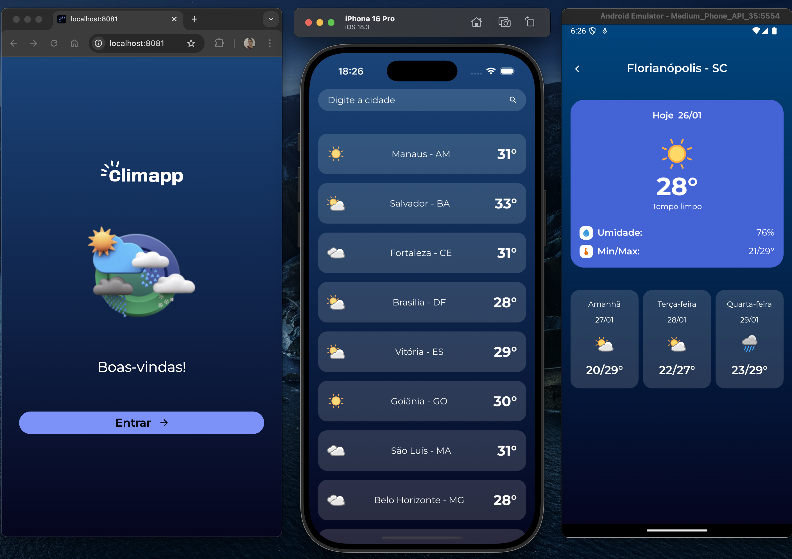

# Climapp

## Contexto

Aplicativo mobile simples de previsão do tempo, desenvolvido com React Native e Expo, como parte dos estudos de desenvolvimento mobile na pós-graduação em Front-End Engineering na FIAP e nos cursos da Alura de React Native com Expo.

### Prévia (Web - iOS - Android)



&nbsp;

## Funcionalidades

Visualização da previsão do tempo atual (de acordo com a API disponibilizada) em diferentes cidades brasileiras;

Busca por uma cidade da lista;

Detalhes da previsão de cada cidade.

&nbsp;

## Tecnologias usadas

**React Native:** framework baseado em React para criar aplicativos nativos para Android e iOS usando JavaScript;

**TypeScript:** superset do JavaScript que adiciona tipagem estática ao código;

**Expo:** uma plataforma que facilita o desenvolvimento com React Native, oferecendo ferramentas e serviços para build, preview e publicação do app.

&nbsp;

## Aprendizados

Este projeto me ajudou a reforçar conceitos importantes aprendidos na pós-graduação em Front-End Engineering pela FIAP e também nas aulas da Alura sobre mobile:

Criação de rotas e navegação com stack;

Requisições para APIs e manipulação de dados;

Exibição de listas com FlatList;

Uso do React DevTools para facilitar o desenvolvimento;

Organização e reaproveitamento de componentes.

&nbsp;

## Como Executar o Projeto

1. Clone o repositório:

```bash
git clone https://github.com/FehSouza/climapp
```

2. Acesse o diretório do projeto:

```bash
cd climapp
```

3. Instale as dependências:

```bash
pnpm install
```

4. Execute a aplicação:

   4.1. iOS:

   ```bash
   pnpm run ios
   ```

   4.2. Android

   ```bash
   pnpm run android
   ```

   4.3. Web

   ```bash
   pnpm run web
   ```

5. Abra o aplicativo com o Expo Go no seu celular ou use um emulador. 
